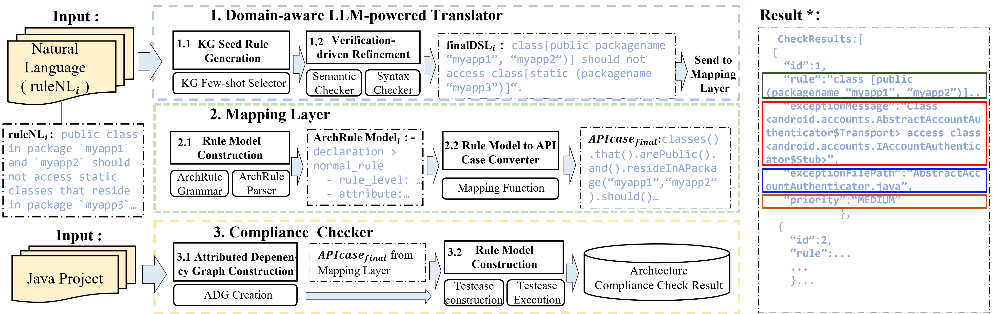

This repository provides the tool implementation, datasets, and scripts for our TSE 2026 submission,
“NLArchTest: From Natural Language Blueprints to Architecture Compliance Checks”.

All data collected from the evaluated real-world subjects are made publicly available.
Due to GitHub file size limitations, only the processed data are included in this repository.

We have provided a video [NLArchTest-sample-demo](Data/Setup/NLArchTest-sample-demo.mov)  to demonstrate of our tool `NLArchTest` running on a sample project.

This is the overview of NLArchTest:

## Directory Structure

The whole directory tree goes like the following: 

```
NLArchTest
├─Data/
│  ├─Results/
│  │  ├─RQ1/
│  │  │  ├─BenchmarkA.csv
│  │  │  ├─ArchRuleDSLResult.csv
│  │  │  ├─DictoDSLResult.csv
│  │  │  ├─GuardingDSLResult.csv
│  │  │  └─RQ1.csv
│  │  ├─RQ2
│  │  │  ├─Prompt.md
│  │  │  ├─RuleSet
│  │  │  ├─BenchMarkB 
│  │  │  ├─NL_input
│  │  │  ├─NLArchTestResult
│  │  │  ├─K-valuePerformanceValidation
│  │  │  ├─SyntaxFirstPerformanceValidation
│  │  │  └─RQ2.csv 
│  │  ├─RQ3
│  │  │  ├─Micro
│  │  │  │  ├─Micro-BenchMarkC
│  │  │  │  ├─NLArchTestResult
│  │  │  │  ├─RuleSet
│  │  │  │  ├─NL1_input.csv
│  │  │  │  └─Result-Micro-RQ3.csv
│  │  │  └─Macro
│  │  │     ├─Macro-BenchmarkD
│  │  │     ├─initialRuleset
│  │  │     ├─input
│  │  │     ├─JArchitectResult
│  │  │     ├─NLArchTestResult
│  │  │     ├─ArchUnitResult
│  │  │     └─Result-Macro-RQ3.csv
│  │  └─RQ4
│  │     └─NASA-TLX _result_9_9.xlsx
│  │     └─NASA-TLX.pdf
│  └─Setup
│     └─ProjectScale.csv
└─Method/
   ├─NLArchTest
   │  ├─bin
   │  │  └─NLArchTest.sh
   │  └─lib/
   │     ├─TranslatorMappingLayer
   │     └─ComplianceChecker.jar
   └─Scripts

```


## Method

### Requirements 

-  Operating System : *Linux*
- `Python` 3.0 or higher.
- `Java Runtime Environment (JRE)` or `Java Development Kit (JDK)` version 21 or higher.
- **Ollama** installed,  (Download and install Ollama from https://ollama.com), with the following models preloaded:
  - LLaMA3.3 70B
  - Qwen2.5 72B
  - Deepseek R1 70B

To switch models or adjust the server endpoints, update the settings in [Method/NLArchTest/lib/TranslatorMappingLayer\config.toml](Method/NLArchTest/lib/TranslatorMappingLayer\config.toml).

### Usage

To use `NLArchTest`, run the script from the command line(After cloning the code repository, please unzip the  [enre.zip](Method/NLArchTest/lib/enre.zip) file in its directory), specifying the necessary arguments. Here is a breakdown of the available arguments:

```less
usage: NLArchTest.bat [-d DIRECTORY] [-r Architecture_COMPLIANCE_RULE] [-p PROJECT_NAME] [-t PROJECT_TYPE] 

arguments:
`-dir` , `-d`: Required Root directory for the project to check violations.
`-rule`, `-r`: Architecture compliance rule for the check.
`-projectname`, `-p`: The name of the compliance check task project.
`-type `, `-t`: The type of the project to check compliances,java or javaClass.

eaxmple usage:
Linux:
.\bin\NLArchTest.sh \\
  -d "/data1/Lnike123/Work/playground/Experiment/RQ4/dataset/opensource/apache-ant-1.8.4/"\\
  -r "public class should be enums" \\
  -p "mycomplianceCheck1" \\
  -t "java"
```

### Exit Status

| Exit Status | Corresponding explanations                                   |
| ----------- | ------------------------------------------------------------ |
| 0           | Everything is fine, no violations found                      |
| 1           | Couldn't understand command-line parameters or NLArchTest exited with an exception |
| 4           | At least one violation has been detected                     |

## Data

### Method prompt in Domain-aware LLM Translator

[Method/NLArchTest/lib/TranslatorMappingLayer/interact_with_llm/src/support](Method/NLArchTest/lib/TranslatorMappingLayer/interact_with_llm/src/support) This folder contains the prompts for Domain-aware LLM Translator.

### Setup

This folder contains the initial data for the project needed to run the four RQs of the experiment.

- Due to the size limitation of the GitHub repository, we uploaded the 9 real-world project sets used in RQ4 to https://zenodo.org/records/18410800
- RQ2: [Data/Results/RQ2/prompt.md](Data/Results/RQ2/prompt.md) is the prompt to generate the initial `NL_input`.
- RQ3&RQ4: `ProjectScale.csv`: Contains files , blanks and code information for real word project.

### Results
#### RQ1: Expressiveness of ArchRule. 

All files or directories mentioned below are in [Data/Results/RQ1](Data/Results/RQ1).  

- The  `BenchmarkA` directory contains the 15 architectural rules used in RQ1.
- The `ArchRuleDSLResult.csv` reports the expressiveness results of ArchRule DSL for the 15 rules.
- `DictoDSLResult.csv` reports the expressiveness results of Dicto DSL.
- `GuardingDSLResult.csv` reports the expressiveness results of Guarding DSL.
- `RQ1.csv` summarizes the RQ1 results, including full, partial, and not expressible outcomes of the three DSLs across the 15 rules.

#### RQ2: Translation Accuracy of NLArchTest.  

All files or directories mentioned below are in [Data/Results/RQ2](Data/Results/RQ2).  

- The  `Ruleset` folder contains the 210 architecture rules for RQ2, `NL_input` contains three form natural language (NL_1, NL_2, NL_3).
- The `NLArchTestResult` folder contains the results of running RQ1 cases with NLArchTest.
- `RQ2.csv` contains the results of RQ2, iincluding success, shifted, and failed counts, as well as P(first), P(final), and P(develop) for three LLMs and three NL variants.

#### RQ3: End-to-End Performance of NLArchTest.

All files or directories mentioned below are in [Data/Results/RQ3](Data/Results/RQ3).
Micro Benchmark

- The `Benchmark` directory contains the Micro-Benchmark for RQ3, including code snippets and code comments.
- The `RuleSet` directory contains the rules used to check the Micro-Benchmark.
- The `NLArchTestResult` directory contains the checking results of NLArchTest on the Micro-Benchmark.
- The `Result-Micro-RQ3` file reports the Precision, Recall, and F1-score computed on the Micro-Benchmark for NLArchTest.

Macro Benchmark

- We evaluate the approaches on 9 real-world projects with 15 architectural rules.

  - The `input` directory contains the natural language rule descriptions.
  - The `benchmark` directory contains the manually curated ground-truth benchmarks.
  - The `NLArchTestResult` directory contains the results produced by NLArchTest.
  - The `JArchitectResult` directory contains the results produced by JArchitect.
  - The `ArchUnitResult` directory contains the results produced by ArchUnit.
  - The `Result-Macro-RQ3` file reports the Precision, Recall, and F1-score computed against the benchmarks for NLArchTest, JArchitect, and ArchUnit across the 9 real-world projects.

#### RQ4: Developer Experience and Practical Usability.

All files mentioned below are in [Data/Results/RQ4](Data/Results/RQ4). 


- `NASA-TLX.pdf` contains the cognitive workload questionnaire designed for this study.
- `NASA-TLX_result_9_9.xlsx` reports the questionnaire results completed by the nine participants after finishing the tasks.
